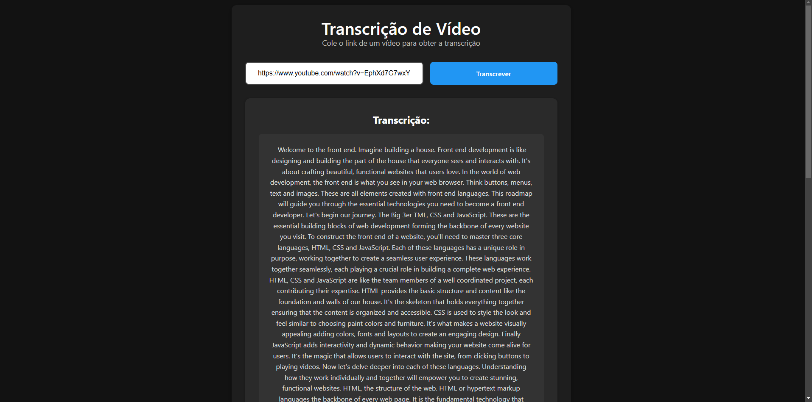
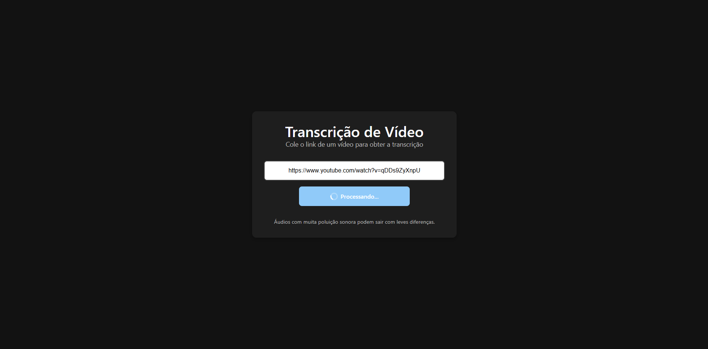

# Transcrição de Vídeo do YouTube

## Imagens  

  

  

## Descrição

Este projeto utiliza um backend desenvolvido com **Python** e **FastAPI** para realizar a transcrição de um vídeo do YouTube via link. No frontend, foi utilizado **React** com **Vite** para configurar a interface.

## Tecnologias Utilizadas

- **Backend:** Python, FastAPI  
- **Frontend:** React, Vite  

## Como Executar

1. Clone o repositório:

   ```sh
   git clone https://github.com/seu-usuario/seu-repositorio.git
   cd seu-repositorio
   ```

2. Abra o terminal e pressione `Ctrl + Shift + 5` para dividir a tela.

3. No primeiro terminal, rode o backend:

   ```sh
   uvicorn app:app --reload
   ```

4. No segundo terminal, inicie o frontend:

   ```sh
   cd frontend
   npm run dev
   ```

5. Acesse a aplicação pelo navegador:

   ```
   http://localhost:5173/
   ```
